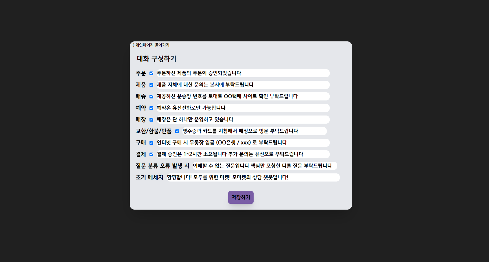

## 챗봇이 필요한 모든 자영업자들, 상인들을 위한

# 모두의 대화 👂

 

### 프로젝트 데이터는 Project Folder / 데모 웹사이트는 Demo Site 에서 확인 가능합니다

-----

    

    

# 목차
------
1. [프로젝트 개요](#🧐-1.-프로젝트-개요)
2. [기능 소개](#📱-2.-기능-소개)
3. [사용 방법](#🎮-3.-사용-방법)
3. [기대 효과](#🎈-4.-기대-효과)
4. [구현 과정](#💻-5.-구현-과정)
5. [발전 가능성](#🚀-6.-발전-가능성)
6. [프로젝트 후기](#😎-7.-프로젝트-후기)
7. [참고 자료](#📖-8.-참고-자료)

# 🧐 1. 프로젝트 개요
-------
> **'모두의 대화'**는 AI 기반의 **누구나 챗봇을 사용할 수 있도록** 모두가 간편하게 이용할 수 있는 챗봇을 구현을 목표로 진행한 프로젝트입니다.

## ✨선정 동기
----
코로나 사태 이후, [자영업자들의 수입](https://view.asiae.co.kr/article/2022090110343601510)은 날이 갈수록 악화되고 있습니다.  또한, 고물가 및 고인건비 시대로 들어서며 [일손은 부족](https://www.mk.co.kr/news/economy/10512926)하며, 손님의 [요구사항과 불만](https://www.fnnews.com/news/202210131436581378)은 더 커져가고 있습니다.  **자영업자들의 부담은 날로 가중되고, 손님들의 요구사항은 날로 늘어가고** 있습니다.

그래서 _자영업자들을 위해_ 무료로 제공하는 챗봇 서비스를 제공하여 **고객 응대를 편리하게 하고자** 했습니다.

## 🎉 개발 목표
소상공인들이 **쉽고 간편하게 매장 맞춤의** , 고객을 응대하는 챗봇을 만들 수 있도록 하는 것입니다.

# 📱 2. 기능 소개
-----
**React.JS 를 기반으로 한 웹사이트**를 구현하여 구성한 NLU 자연어 처리 모델의 활용 방안에 대한 **데모 사이트**입니다.  
[데모 사이트 접속](https://chatingaiforeveryone.web.app/)   
소상공인들이 쉽게 이용할 수 있도록, **간단히 구현**하였으며 대화가 이뤄지는 방식까지 보여주기 위해  관리자 페이지와 고객용 페이지를 **한 번에 확인이 가능하도록 구현**했습니다.  

## **메인 페이지**

    

    

메인 페이지에서 **관리자 기능**과 **챗봇 화면**으로 이동할 수 있습니다

## **관리자 페이지**

    

    

NLU 모델에서 학습시킨 주문, 제품, 배송, 예약, 매장, 교환/환불/반품, 구매, 결제 등의 **주제로**  **질문 입력 시**, **원하는 대답을 출력**할 수 있습니다.

## **고객용 페이지**

    

    

관리자 페이지에서 설정한 질문의 주제별 대답을 바탕으로 **원활한 질의응답이 가능**하며,  각 주제에 **해당하는 대답을 얻을 수 있습니다.**

# 🎮 3. 사용 방법
---
## 데모 사이트 접속 시
1. [데모사이트](https://chatingaiforeveryone.web.app/) 에 접속합니다.
2. 관리자 페이지에서 해당 주제의 질문이 입력되었을 시 원하는 대답을 작성 후 **저장 버튼**을 누릅니다.
3. 고객용 페이지에 접속하여 **챗봇과 채팅을 진행**하면 됩니다.

 

## 로컬 이용 시
1. [github](https://github.com/stpcoder/AiChatBot) 레포지토리에 접속합니다.
2. git clone 을 통해 코드를 **로컬 환경으로 다운**받습니다.
3. 터미널에서 **`yarn install`** 을 입력하여 **dependency 들을 설치**합니다.
4. 터미널에서 **`yarn start`** 를 입력하여 **로컬 환경에서 웹을 구동**하면 됩니다.

# 🎈 4. 기대 효과
-----
## 기대 효과

- **예산 운영비 절감**

    - 인건비 부담이 큰 현대 사회에서 고객 응대로 인한 응대 비용의 절감
    - 고객 응대 비용 절감으로 인한 예산의 효율적 운영
    - 예산 자체의 효율적인 운영에 따라 능률적인 경영이 가능

- **고객 만족도 증가**

    - 기존 유선 상담에 비해 시/공간적 제약이 없는 상담으로 인한 고객 만족도 증가
    - 90%가 넘어가는 발화의도 파악의 정확도로 인한 효과적인 고객 응대 가능

- **편리한 사용법과 저렴한 비용**

    - 현재 제공되는 챗봇 서비스에 비해, 텍스트만 작성하면 될 수준으로 간편한 사용법 제공
    - 1,000 건당 X 원 부과되는 서비스와 달리, 서버 운용 비용을 제외하면 무료
    - 채팅 서비스까지 포함하여 챗봇 서비스 전체를 이용 가능

# 💻 5. 구현 과정
---
프로젝트는 크게 **데이터 전처리** -> **AI 모델 구현** -> **API 배포** -> **웹사이트 제작** 으로 구성되어 있습니다.

## 5-1. 데이터 전처리

사용한 데이터는 AiHub의 [소상공인 고객 주문 질의-응답 텍스트](https://aihub.or.kr/aihubdata/data/view.do?currMenu=115&topMenu=100&aihubDataSe=realm&dataSetSn=102) 로 콜센터와 전화상담 등 **음성을 기록하여 텍스트로** 정리하여 구현한 데이터셋입니다. 약 **500만건 이상의 충분한 데이터** 를 갖고 있어 이 데이터를 선정했습니다.  

    

    

각 데이터는 위에 사진처럼 크게 **발화자/발화문 그리고 발화문을 나누는 카테고리**로 이루어져 있습니다. 이 중 챗봇을 구현하기 위해서는 해당하는 질문에 대한 대답이 필요한 것이므로, **발화문과 인텐트만을 이용**하도록 전처리했습니다.   
또한, 인텐트 부분을 보면 '배송_비용_질문' 과 같이 **총 3개로 인텐트가 분류**되어 있습니다. 각 부분별로 학습해야할 발화문의 종류가 늘어나므로, 인텐트를 기준으로 **데이터를 총 3 종류로 분류**하여 **각 모델의 데이터를 제작**했습니다.
  
데이터 전처리를 위해 제일 유념했던 부분은, 구어체들이 많이 사용되었으며, 학습에 방해되는 특수문자와 같은 요소들도 많았습니다. **특수문자를 전부 제거**하였으며 발화문의 길이를 제한하고자 **64자 이내의 발화문만을 선정**하였으며, 인텐트의 숫자가 늘어날수록 **각 value 별 데이터의 개수**를 비슷한 수치로 제한하여 학습 효과를 늘리고자 하였습니다.
  
1. **가장 큰 분류 기준으로 한 데이터**  
    '배송 _ 비용 _ 질문' 중 '배송' 과 같이 가장 큰 범주에 해당하는 데이터만을 전처리했습니다.
     종류는 총 8가지로 '결제' , '배송' , '예약', '제품', '주문', '포장', '구매', '교환|반품|환불', '매장' 만을 이용했습니다.
   
2. **세부 분류를 기준으로 한 데이터**  
    '배송 _ 비용 _ 질문' 중 '배송 _ 비용' 을 결합한 데이터로 가장 큰 범주의 데이터와 두번째 세부 분류 범주까지를 포함한 데이터로 전처리했습니다. 종류는 총 58가지로 8가지의 큰 범주의 데이터와 취소, 구성, 할인, 비용 등 세부 항목들이 결합된 형태 전체를 기준으로 분류했습니다.
  
3. **발화 의도를 기준으로 한 데이터** 
    '배송 _ 비용 _ 질문' 중 '질문' 과 같이 발화 자체의 주제를 제외한 화행을 가지고만 분류했습니다.  
    종류는 총 4가지로 '확인', '비교', '질문', '요청' 으로 4가지 종류로 이루어져 있습니다. 

 

각 데이터는 이용자의 질문 주제를 파악하기 위해 이용됩니다. 챗봇 대화 시나리오 작성 시 **첫 번째 데이터를 학습한 인공지능의 경우** 발화자의 **가장 큰 주제를 분류**할 수 있도록 합니다. **두 번째 데이터**를 기반으로는 **발화의 세부 주제를 확인**할 수 있도록 하여 각 **세세한 상황에 따른 대답**을 작성할 수 있도록 합니다. 마지막으로는 **발화의 의도에 따라 대화의 진행 방식을 결정**할 수 있도록 총 3가지로 구성했습니다.

 

    

    

첫번째 모델부터 세번째 모델에서 추출된 데이터까지의 라벨링 분포도를 차례로 첨부하였습니다. 각 class 별 데이터의 수를 균일하게 유지하도록 데이터 추출 전, 개수를 맞췄으며, 학습 시간 제약으로 인해 각 데이터별로 약 6만개만을 이용하였습니다.

 

>자세한 코드는 **`프로젝트 폴더 > 2.데이터 전처리 > csvFileMake.ipynb`** 에서 확인하실 수 있습니다.  
또한, 전처리 후 데이터는 **`프로젝트 폴더 > 2. 데이터 전처리 > 전처리 후 데이터`** 폴더에서 확인할 수 있습니다.

## 5-2. AI 모델 구현

elice의 [고급-자연어처리](https://military22.elice.io/tracks/2281/info) 프로젝트 교육을 학습하고, 이를 토대로 모델을 구현했습니다. 

전처리된 텍스트를 학습하기 위해서 형태소 분석에 활용되는 패키지는 **KoBERT** 를 활용했습니다. BERT는 약 **33억 개의 단어로 pretrain 되어 있는 기계번역 모델**입니다. 하지만 영어에 대한 정확도에 비해 한국어에 대해서는 **영어보다 정확도가 떨어집니다.** 따라서 좋은 알고리즘을 갖고 있는 BERT 모델을 한국어에도 잘 활용할 수 있도록 만들어진 것 중에 하나인 **KoBERT를 사용**하게 되었습니다.

이러한 KoBERT는 SKTBrain에서 공개한 기계번역 모델으로, KoBERT는 BERT 모델에서 **한국어 데이터를 추가로 학습시킨 모델**로, 한국어 위키에서 5백만개의 문장과 54백만개의 단어를 학습시킨 모델입니다. 

KoBERT 를 기반으로 학습 모델을 구현하기 전, BERT 모델에 대해 **간단히 자료를 조사하고 학습을 진행한 이후** 코드를 작성했습니다.

### 이론적 배경
---
### BERT - Transformer

    

    

BERT는 Transformer 모델의 구조를 여러 층으로 쌓아서 구성된 모델입니다. 위 사진이 바로 **Transformer 모델의 구조** 입니다. 좌측의 경우 **Encoder 역할을 하는 부분**과 **Decoder 역할을 하는 부분**으로 나뉘어 있으며, BERT 는 **Transformer 의 Encoder 만을 활용**하기 때문에, 왼쪽 구조만을 활용하게 됩니다.

Transformer 는 위에서 설명했던 것처럼 **Encoder와 Decoder 로 구분**되어 있으며, 총 **n 개의 encoding layer** 를 갖고 있습니다. 각 Encoder 별로 sub layer 가 **Self Attention과 Feed Forward network 2가지**로 나뉘어 있습니다. **Self Attention (문장 내의 유사도를 구하기 위한 layer)** 가 바로 Transformer 모델의 **핵심적인 부분**으로 문장이 BERT 모델에 입력되면 이러한 **Self Attention layer** 들을 거치게 되어 **문맥을 포함한 하나의 문장**으로 출력되게 됩니다.

### BERT - Contextual Embedding

    

    

위의 Transformer 를 통해 출력된 문장은 **문장의 문맥이 반영된 Embedding 으로 출력**이 됩니다. 각 단어들이 개별적인 객체로서 작용하는 것이 아닌, **서로가 연관된 단어 벡터로서 임베팅이 되어 출력**되게 됩니다.

### BERT - Self Attention

우선 Attention 은 Query 를 기반으로 하여 제공된 Key 사이의 유사도를 구하여 각 유사도를 가중치로 사용하고 **Value를 구하게 됩니다.** 이렇게 구하게 된 **Value 들을 모두 가중합하여 반환**하는 것이 바로 **Attention** 입니다. 이러한 **Attention 을 본인에게 수행**하는 것이 **Self Attention** 입니다.

    

    

위의 그림처럼, 문장에 대해 **Query, Key, Value vetor 들을 정의**하게 됩니다. 이 vector 들을 기반으로 가중치 행렬을 곱하여 vector을 획득하게 되고, **모든 vector 에 연산을 수행하여 Attention** 을 구할 수 있습니다. 이렇게 구해진 행렬을 기반으로 **일련의 연산**을 적용하고 **SoftMax 함수**를 활용하게 되면 **Attention Matrix** 를 구할 수 있게 됩니다.

### **BERT - WordPiece**

텍스트를 **Tokenzie -> Encoding -> padding** 과정 순서대로 작업을 거쳐야 합니다.
BERT 의 경우 WordPiece 를 활용하여 토큰화하며 **자주 등장하는 단어를 단어 집합**에 추가하며, **자주 등장하지 않는 단어**는 **subword로 분리**하여 추가하게 됩니다.

### **BERT - Pre-training & Fine-tuning**

BERT는 MLM 과 NSP 를 통해 **pre-training 을 우선적으로 수행**하게 됩니다. **MLM이란** 사전에 입력되는 단어 토큰 중 일부만을 masking 하여 **원래 단어를 예측**하는 것을 통해 학습하는 과정입니다. 또한, **NSP 의 경우** 랜덤한 두개의 **문장의 서로 이어지는지 여부**를 파악하여 이를 기반으로 학습을 진행하게 됩니다. **BERT**는 **Pre-training을 통해** 사전에 구축된 데이터 셋을 바탕으로 미리 사전 학습을 거친 뒤 모델을 제공하여 학습의 **정확도가 매우 높아지게 됩니다.**

BERT를 기반으로 구현한 **KoBERT 또한 마찬가지로 수백만개의 말뭉치를 기반으로 **pre-training 후 제공**되는 모델이므로, 일부분의 데이터만을 활용하여 output layer 를 추가하여 활용할 수 있게 됩니다. 따라서 사전에 준비한 데이터 set 과 intent 기반으로 추가 학습을 거친 뒤 알맞는 답면이 도출되는 output-layer 를 추가하여 모델을 제작할 수 있게 됩니다.

### 구현
---
이렇게 BERT 모델에 대한 이론적인 내용을 학습한 이후, [KoBERT github 코드](https://github.com/SKTBrain/KoBERT)를 기반으로 모델을 구현했습니다. 구현 환경은 Google의 Colab을 활용하였으며 GPU를 기반으로 학습을 진행시켰습니다.

전처리된 파일을 읽고 이를 tokenize 과정과 padding 등의 과정을 수행하였으며, 이후 **BERTSentenceTransform 모듈**을 통해 **토큰화와 패딩**을 진행했습니다. 

각 데이터에 맞는 batch_size와 max_len 등 **변수값을 설정**했습니다. 학습 모델 속 class도 마찬가지로 데이터의 분류 **기준 값에 맞도록 설정**했습니다. 

학습 시간 제약으로 인해 **epoch 의 수를 5회로 고정**하여 학습을 진행하였으며, 각각 데이터에 해당하는 **모델별 정확도**를 출력하였습니다.

    

    

각 모델의 정확도는 **79% / 64% / 73%** 으로 두번째 모델을 제외하고 **대부분 정확도가 높은 편**에 속했습니다. 두번째 모델의 경우 class 수가 약 60개로 분류할 데이터가 많았던 반면 **각 데이터별로 발화문의 개수가 충분치 않아서** 데이터의 수를 균일하게 맞추다 보니 일부 **정확도가 떨어지는 경향**이 있었으나 60% 이상으로 준수한 성능을 보였습니다.

이후, 예측 함수를 구현하여 모델의 실제 예측 값을 출력하였습니다. 실제 문장을 읽었을 때, 거의 대부분의 내용이 라벨링한 결과에 맞아 떨어지는 모습을 확인할 수 있었습니다.

    

    

이후 모델을 **pt 파일로 저장**하고 3가지 데이터를 기반으로 **3개의 모델을 구축**하였습니다.

>자세한 학습용 코드는 **`프로젝트 폴더 > 3. AI 구현 > make first/second/third NLUMODEL.ipynb`**에서 확인할 수 있습니다  
구현된 모델은 **`프로젝트 폴더 > 3. AI 구현 > 학습된 AI > first/second/third NLUModel.pt`**서 확인하실 수 있습니다.

## 5-3. API 배포

학습된 모델을 배포하기 위해, 여러 상황을 알아보던 중, 이용하고 있는 사지방 특성상 제약이 많아 Docker를 활용한 서버 구현이 불가능했습니다. 여러 방법을 찾아보던 중 AI 모듈을 연결해주는 **Naver Cloud** 에서 제공하는 **Api GateWay**를 활용하였습니다.

    

    

학습된 AI 모듈을 Endpoint로 활용하여 API에 연결하였으며, **Naver Cloud Api Gateway** 에서 생성해주는 **Invoke URL** 을 활용하여 **Front-end 와 Ai를 연결**할 수 있었습니다. 모듈을 구현하고 이를 **Endpoint 연결** 이후, Cloud 에서 발급되는 **Key와 URL을 기반으로 통신에 활용**했습니다.

    

    

또한, Swagger 기반 **API Docs**를 생성하여 API 와 통신 시 활용하였습니다. **RESTFUL API** 를 생성하여 통신에 활용하였으며, 기본 Invoke URL 에 post method를 통해 메세지를 주고 response body에 응답에 해당하는 메세지를 **response**로 돌려주도록 구현했습니다.

## 5-4. 웹사이트 제작

구현된 API 를 이용하여 간단한 **챗봇의 구동 방식을 표현**하고자 웹사이트를 구현했습니다. 

구현 과정은 크게 기능 구상 -> 디자인 설계 -> 실제 구현 -> 배포 까지의 과정으로 구현하습니다. 디자인의 경우 **Figma** 를 통해서 디자인했으며, 동적인 채팅 방식을 웹으로 구현하기 위해 **React** 프레임워크를 활용했으며 디자인으로는 **Tailwind** 를 활용하여 디자인을 입혔고, 배포는 **Firebase** 로 배포하였습니다.

### 웹 디자인
---
[피그마 디자인 페이지](https://www.figma.com/file/TVQOfEHyMnJcQ5xHXzLYfj/Untitled?node-id=0%3A1&t=nyapoAPiFTfZ1zI3-1) - 웹은 크게 3개의 페이지로 나뉘어 있습니다.

**첫 페이지**는 가장 기본적으로 보여지는 페이지로 채팅 페이지와 관리자 페이지로 나뉠 수 있는 **버튼 두개**와 **일부 설명**으로 구성되어 있습니다. 채팅 스타일을 유지하기 위해 모든 화면을 rounded box로 **가운데에 위치**하도록 하였으며, 시선이 유지되도록 배경을 **회색 계열**, 강조할 부분은 **보라색 계열**의 색상을 활용했습니다. 

**두번째 페이지**는 관리자 페이지로 메인 페이지와 유사한 디자인을 사용합니다. 메인 페이지로 돌아갈 수 있는 **버튼**과 기존에 지정되었던 대화 주제별로 이 주제를 사용여부와 각 주제의 대화가 입력되었을 경우 **출력되는 대답을 지정**할 수 있습니다.

**세번째 페이지**는 고객용 페이지로 마찬가지로 다른 페이지들과 유사한 디자인을 사용합니다. 메인 페이지로 돌아갈 수 있는 **버튼**과 메세지를 입력하는 칸, 채팅 보내기 **버튼**으로 구성되어 있습니다. 보낸 채팅은 **보라색 계열**로 강조되어 표시되고 받은 채팅은 **회색계열**로 표현되게 디자인했습니다.

    

    

### 코드 구현
---
사이버지식정보방에서 구현하기 위해 github에 코드를 저장하고 **codespace**를 활용하여 프론트엔드를 구현하였습니다.  
코드는 크게 **`Index -> App -> Routing -> AdminPage / UserPage / MainPage`** 로 구성되어 있습니다.

    

    

우선 **`index.js`** 의 경우 최상단에 위치해있으며, root 디렉토리에 App 을 씌워주며 React 앱이 실행되도록 합니다.
 **`App.js`** 의 경우 react-router-dom 을 사용하기 위해 BrowserRouter를 활용하여 Routing element를 감싸주는 역할을 하고 있습니다.

    

    

**`Routing.js`** 의 경우 크게 두가지 역할을 담당하고 있습니다. 우선 기존에 발화문의 주제를 8가지 타입으로 저장한 것에 맞추어 각 발화문의 주제별 응답을 useState를 통해 **state로 설정**했습니다. 설정된 state들을 **admin page**와 **user page**에 각각 전달하여 admin 페이지에서는 이 값을 설정하고, user page에서는 이 state의 값을 받는 역할을 수행하고 있습니다. 두번째로 각 페이지를 **routing 해주는 역할**을 하고 있습니다. Router tag 속에 묶인 route 태그에서 element로 각 페이지 component를 불러와서 **각 path로 component들을 할당**해주는 역할을 하고 있습니다.

    

    

**`axios.js`** 에서는 **Axios**를 바탕으로 API와 통신을 진행하는 axiosPost 함수를 구현하였습니다. **Naver Cloud API Gateway** 통신시 사용되는 **Key와 Invoke URL를 기반**으로 통신을 진행합니다. **Response Body**의 형식과 **Header**의 형식을 맞추어 통신을 진행하며, Header의 경우 **Hmac-sha256 기반의 암호화**를 진행했습니다.

    

    

각 페이지별 고유한 component들을 생성하여 이를 Routing에 활용하고 있습니다. 페이지별 **디자인의 통일성을 유지**하는 것에 집중했으며, **Navigate**를 활용하여 페이지 이동을 구현했습니다. 또한 Routing 에서 전달된 **state들을 활용**하였습니다.

    

    

프로젝트에 설치되고 **사용된 패키지**들은 다음과 같습니다

    

    

### 배포
---
react **firebase-tools**를 활용하여 **firebase single page** 기반으로 deploy 했습니다.  개인 페이지로 hosting 했으며, yarn 을 통해 **build 된 index.html**을 기반으로 배포했습니다.  

[배포된 사이트](https://chatingaiforeveryone.web.app/)

> 자세한 코드는 **`프로젝트 폴더 > 4. 웹사이트 구현 > AiChatBot-Main`** 에서 확인하실 수 있습니다  
혹은 [github repository](https://github.com/stpcoder/AiChatBot)에서 확인하실 수 있습니다

# 🚀 6. 발전 가능성
---

- **모델의 세분화**  
    현재 구현된 모델은 큰 발화문만 갖고 판별하였으나, 주제와 화행 말고도 어떤 제품을 가지고 문의를 하는건지 **제품명 혹은 상세 정보 등을 추출할 수 있는 모델을 추가로 구현**하면 발화에 있어서 **어떤 맥락과 목적을 갖고 있는지**를 확인할 수 있습니다.
    
    
    
- **챗봇 시나리오**  
    세부 주제로 구현된 AI를 활용하거나 **세부 주제와 화행을 같이 결합**하여 **세부 주제 -> 질문**일 경우 대답 혹은 **세부 주제 -> 확인**일 경우에 따라 **대화의 구성을 다르게 활용**할 수 있습니다. 또한, 대화를 이어갈 수 있도록 **시나리오 기능을 추가**하여 이용자 발화의 화행에 따라 대화를 진행시킬 수 있습니다.
    
    
    
- **여러가지 활용 분야** 
    현재는 소상공인을 위한 질의응답에 활용하고 있지만, 다중 의도 분류기는 주제를 감정으로 바꾸어서 데이터를 감정을 기반으로 라벨링 된 데이터를 활용한다면 **감정 분석기로도 이용이 가능**합니다. 즉, 기본적인 틀은 그대로지만 어느 분야에 활용하냐에 따라 그 활용 가능성은 **무궁무진합니다.**

# 😎 7. 프로젝트 후기
---
저는 인공지능에 대한 배경지식이 전혀 없었습니다. 컴퓨터 공학과를 2년여 동안 재학하며 코딩에 대한 기본적인 지식만 있었지 이를 활용하는 방법들에 대해서는 잘 아는 바가 없었습니다. 군에 입대하고 막연히 어느 것을 준비하고 공부해야겠다 생각했던 것도 없었습니다. 그러던 찰나 엘리스라는 플랫폼을 발견했고, 이를 통해 인공지능에 대해서 차례로 공부할 수 있었습니다. 그렇게 차례로 프로젝트 교육과 이론 교육을 수강하며 지식을 쌓을 수 있었습니다. 

특히 프로젝트 교육들을 수강하며 이를 활용하면 어떨까? 하는 프로젝트들이 많아서 이를 활용해보고자 여러 주제들을 고민했었습니다. 그러던 중 기존부터 웹 개발을 진행하며 꼭 제작해보고 싶었던 챗봇 프로그램을 고급 자연어처리 과정을 수강하며 만들 수 있겠다 싶어졌습니다. 과거 챗봇을 통해 소상공인을 도와주는 프로젝트를 기획까지만 했었는데 인공지능과 관련된 지식이 부족하여 구현하지 못했던 프로젝트를 구현하겠다 결심했습니다. 특히 고급 프로젝트 중 발화자의 의도를 BiLSTM으로 구현하여 의도를 파악했던 Keras 모델을 직접 배포하여 이를 실제 챗봇에 활용하면 좋겠다고 생각했고, 곧바로 실행에 옮기게 되었습니다.

우선, 소상공인을 위한 프로젝트인 만큼 기존 데이터와는 달리 소상공인을 위한 질의응답에 활용된 데이터를 선정했습니다. 데이터의 특징을 살펴보며 적절한 모델을 찾아보았고, 특히 한국어의 의도 분석에 많이 활용되고 정확도 또한 우수한 KoBERT 모델을 활용하고자 했습니다. AI 모델을 구현하는 중에도 개발 환경의 부족으로 인해 학습에 오랜 시간이 걸리기도 했고, 데이터 수는 많지만 실제 학습에 활용되는 데이터의 수는 너무나도 적었습니다. 그래서 AI 자체의 정확도가 90% 이상을 달성하지 못해서 아쉽기도 했습니다. 또한, 데이터를 살펴보며 실제 사람의 발화 내용을 담은 데이터이므로 라벨링이 일부 오류도 많았으며, 발화자의 의도 자체가 중복되는 내용도 많아서 정확도가 낮은 경우도 많았습니다. 데이터 자체로 인해 학습과 정확도에 아쉬움이 남기도 했습니다.

이외에도 인공지능의 학습과 관련해서 Colab 자체에서 무료로 제공하는 GPU의 사이즈 혹은 러닝타임이 제한이 되어 오랜 기간동안 학습을 진행하는 것 조차 불가능에 가까웠고 결국 울며 겨자먹기로 학습에 이용하는 데이터의 수를 억지로 줄이게 되기도 하며, 하드웨어적인 성능과 제 물리적인 환경과 시간이 애석하기도 했습니다.

이후에는 학습된 AI를 바탕으로 API로 배포하여 웹에서 사용할 수 있도록 구현하는 과정도 험난했습니다. 웹에 사용하는 프레임워크를 React 로 결정했기에 JavaScript 기반으로 AI를 활용할 수 있도록 모델을 변환해야 했으나, Pytorch 모델이 JS로 변환하는 과정이 따로 없어, 새로운 방법을 찾아야만 했고 구글링을 통해 Naver Cloud 를 활용하게 되었습니다. Naver Cloud 를 실제 AI 모델을 Gateway API를 활용해 내보내는 오픈소스 프로젝트가 없어, 문서를 보며 구현하는 데에도 많은 어려움이 있었지만 문서 속 예시 코드와 Swagger를 통해 API를 구현할 수 있었습니다.

사회에서는 간단히 VS code를 통해 React 웹을 구현했으나 사이버지식정보방 환경에서는 프로그램 설치조차 어려웠고, 이 또한 마찬가지로 구글링을 통해 간신히 Codespace를 통해 직접 웹 상에서 빌드를 해보며 웹을 구현할 수 있었습니다.

그렇게 데이터 선정부터 웹 배포까지 많은 어려움이 존재했지만 하나의 완성된 프로젝트로 이를 구현할 수 있었습니다.

군 생활 중에 인공지능을 새롭게 공부해보고, 기존에 해보지 못했던 혹은 구현할 능력이 없어서 구현하지 못했던 인공지능을 활용하는 프로젝트에 적용해보며 개인적으로 많은 발전이 있었습니다. 인공지능을 이제는 다룰 수 있는 능력이 생기기도 했으며, 인공지능을 활용해 웹에 적용하고 실제 사회의 도움이 필요한 곳에 적용할 수 있는 능력을 길렀습니다. 군 생활 중에도 많은 변화가 있었습니다. 군 생활동안 목적이 없어 휴대폰만 보며 시간을 보내던 저에게 인공지능을 공부하여 하나의 새로운 목표가 생기게 되었고, 이제는 세웠던 여러가지 목표 중 하나를 이루게 되었으며 이제 앞으로 더 나아가 다른 목표를 이룰 에너지도 얻게 되었습니다. 앞으로 전역 이후 사회에서는 군 생활 중 배웠던 인공지능을 기반으로 사회에서 도움을 필요한 분야에 직접 다가가 실용성 있는 프로덕트를 개발하여 사회적 코더가 되는 것이 저의 새로운 목표가 되었습니다.

앞으로도 꾸준이 학업에 정진하며 남은 군생활 열심히 보내도록 하겠습니다. 군인들을 위해 이러한 기회를 제공해준 모든 분들께 감사드리며 교육을 진행해 준 앨리스에게도 감사의 말씀 전하며 후기 마치겠습니다. 긴 글 읽어주셔서 감사합니다.

# 📖 8. 참고 자료
---
**데이터셋** - [Ai Hub](https://aihub.or.kr/aihubdata/data/view.do?currMenu=115&topMenu=100&aihubDataSe=realm&dataSetSn=102)

**AI 구현** - [KoBERT Usage](https://velog.io/@seolini43/KOBERT%EB%A1%9C-%EB%8B%A4%EC%A4%91-%EB%B6%84%EB%A5%98-%EB%AA%A8%EB%8D%B8-%EB%A7%8C%EB%93%A4%EA%B8%B0-%ED%8C%8C%EC%9D%B4%EC%8D%ACColab)

**KoBERT 활용** - [KoBERT github repository](https://github.com/SKTBrain/KoBERT)

**네이버 AI 연동** - [Naver API GateWay Docs](https://guide.ncloud-docs.com/docs/ko/apigw-apigw-1)

**웹사이트 디자인** - [TailWind Chatting Desing Example](https://codepen.io/robstinson/pen/oNLaLMN)

## 개발자 연락처

<a href="mailto:thbrian@postech.ac.kr">

